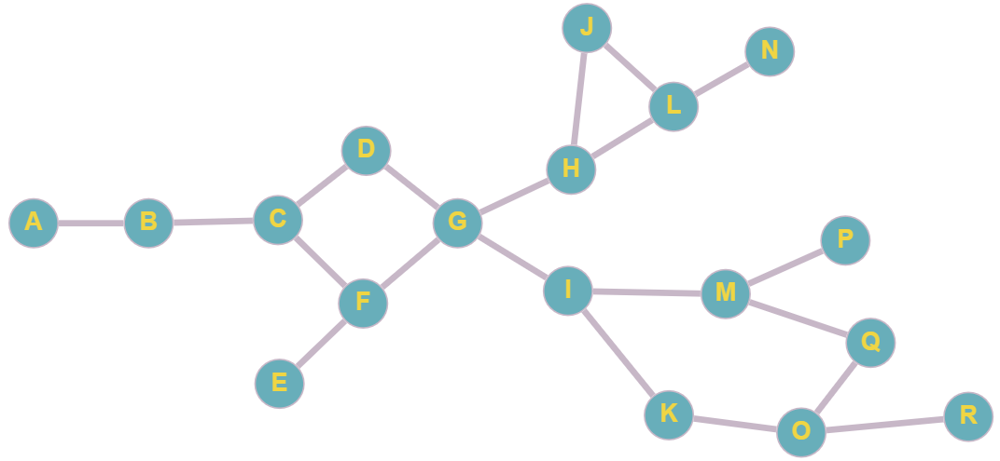

# Busca em Largura (BFS)  

## Descrição  
Este é um projeto simples em **Java** que implementa o algoritmo de **Busca em Largura (BFS - Breadth-First Search)** para encontrar o caminho mais curto entre dois nós em um grafo não direcionado.  

O grafo é pré-definido no código e contém nós de **"A" a "R"** com suas respectivas conexões.  

## Grafo  
Abaixo está a representação visual do grafo utilizado no projeto:  

  

## Como Funciona  
- O BFS explora o grafo **camada por camada**, partindo de um nó de origem.  
- Utiliza uma **fila** para controlar os nós a serem visitados.  
- O usuário informa a **cidade de origem** e o **destino**.  
- O algoritmo retorna o **caminho mais curto** entre eles.  

O grafo é representado por um `Map`, onde cada chave é o nome de um `Node` e o valor é o próprio objeto `Node`, que armazena seus vizinhos.  

## Estrutura do Projeto  

- **pacote principal**  
  - `Principal.java`: Classe que inicia a aplicação, cria a instância de `BuscaLargura` e chama o menu.  
  - `BuscaLargura.java`: Contém a lógica do grafo e do BFS.  
    - `preencherGrafo()`: Inicializa e conecta os nós.  
    - `buscaLargura(Node origem, Node destino)`: Implementa o algoritmo BFS.  
    - `menu()`: Interage com o usuário para obter origem e destino.  

- **pacote modelo**  
  - `Node.java`: Representa um nó do grafo, com seu nome e lista de vizinhos.  
